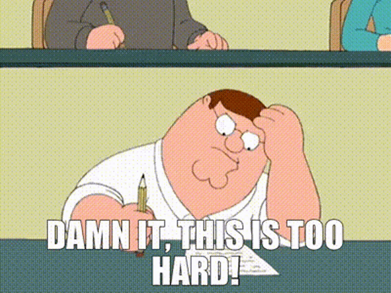

# Steganography

One day, I received an email from a coworker with a kind invitation to a feedback call. At the very end of his message he stated that there is a secret message hidden in the email.

This tickled my curiosity. I decided to find the message... come what may! This is my quite short yet surprisingly eventful journey.

## Finding the Hidden Message
At the end of the email, I found a few blank spaces tagged as a hyperlink with a fake email address "try_again" and the subject line "Too easy, try again". This was a red herring.

I pulled the __email__ out of Outlook (I know...) onto the desktop and opened the resulting file in a text editor. Turns out that Outlook hashes the contents of an email and provides it in two different formats: as plain text and as HTML. Now the HTML was distressingly ugly. It had inline styling and looked sickeningly convoluted. I could not find any indication of a hidden message there. Though, I did learn something: machine-generated HTML is still far worse than hand-crafted HTML.

I then looked at the __recipients__ of the email. They included other coworkers but also another obviously fake email address.
```RGlkIHlvdSByZWFsbHkgdGhpbmsgdGhhdCB0aGlzIHdhcyBnb2luZyB0byBiZSBlYXN5PyAiYUhSMGNITTZMeTlwYldkMWNpNWpiMjB2WVM5YVJYbERaek5XIg==@notreallydomain.com".```

This must be the hidden message.

## Decoding the Hidden Message

The string before the @ sign looked like a hash of some sort. I assumed that the end of the fake email address `@notreallydomain.com` should not be included in any attempts to decode it. The trailing `==` looked familiar and I assumed that they terminate some kind of encoding. I went to [10015.io](https://10015.io/tools/base64-encoder-decoder) and ran the string through some of the decoders. It turned out that it is __Base64__ encoded.

The decoded message reads:
```Did you really think that this was going to be easy? "aHR0cHM6Ly9pWnd1ci5j2vYS9aRXlDazNW"```

Turns out the string aHR0cHM6Ly9pWnd1ci5j2vYS9aRXlDazNW is also Base64 encoded. After decoding it, you get an actual link [https://imgur.com/a/ZEyCg3V](https://imgur.com/a/ZEyCg3V)



Based on the contents of the image, I thought that this is another red herring. Nevertheless I sent it to my coworker. Even though I did not believe that this is the hidden message I was looking for, it was at least _some kind_ of hidden message.

My coworker replied with a cryptic statement: ```Did you know? Within digital imagery, hidden whispers await. Pay close attention—they may reveal the concealed truth.```

Maybe living in Greece has already made an impression on me but that statement sounds a bit like the proclamation of the _Oracle of Delphi_ from ancient Greek times. It confirmed that I was on the right track. 

I decided to look at the upload date on Imgur to see how old the image is and it looked quite fresh at only a few days prior to the current date. Taking into account the time that I left the email unanswered and the time it might have taken my coworker to write the email, it was very likely that he had uploaded the image himself. Therefore, the hidden message __must__ be in the image!

## Image Madness

Even though I have no idea how to encode a message into an image, I thought it might be a good idea to download the actual file to analyze it in detail. 

There are two ways of downloading images from Imgur. I first dragged the image from the browser to the local file system. This gave me a .webp file. Call me old-fashioned but I kinda dislike .webp files. So I clicked on the little download icon Imgur provides at the top of images. This gave me a .png file. I compared the file sizes. The .webp file I had dragged directly from the browser had a considerably smaller file size than the .png file. While I can't say for certain, I assume that Imgur automatically converts files to .webp to reduce their file size and conserve bandwidth. This allowed for the conclusion that the original format of the uploaded file is .png. If the image has a hidden message, then I'd better look for it in the larger file.

I opened the file with [Graphic Converter](https://www.lemkesoft.de/en/products/graphicconverter), a MacOS app that acts as a true swiss army knife for extracting as much metadata as possible from image files in any format (including some obscure medical image formats and most historic image formats all the way back to 8-bit machines from the early 1980s).

No luck there... none of the EXIF data or other metadata looked useful. I couldn't find a hidden message using Graphic Converter.

## Pillow to the Rescue

Like any person lost for the right answer, I simply googled for "hiding messages in a png image". This looked promising. I started to familiarize myself with the concepts of [Steganography](https://en.m.wikipedia.org/wiki/Steganography). I had heard of that term in conjunction with hidden message in ancient Greece but had to learn some of the details. Again this might be my extended stay in Greece playing mindgames with me.

Among the results of the web search I bumped into a post on Medium about decoding a hidden message from a PNG using __Python__. I knew that while my coworker is impressively adept in many programming languages, I think that he prefers Python. At least that is my impression because when we review JavaScript code together, he uses sophisticated but alien terms like _dictionary_ and _tuple_ that do not apply to rickety, old JavaScript.

Anyway, it was worth a try. It might well be the solution to finding the hidden message. You can find the Medium post with the solution by Dayanand Shah [here on Medium](https://dayanand-shah.medium.com/the-art-of-hiding-secret-messages-in-images-with-python-steganography-5a6583065856)

I'm not going pretend that I know anything about steganography in Python. According to the Medium post, you can encode a binary message in a .png file in the least significant bit of each color channel (red, green, and blue). Fortunately, the post not only provided the Python code for encoding a message in an image but also how to __decode__ it.

I installed pillow and ran the Python code on the image file. And I was astounded... I actually got a clear text message printed to the console:
```Congratulations! You're as awesome as me :-)```

Now I don't think that I am awesome... but my coworker sure is! I sent him the message that I had found and he confirmed that this was correct.

I was so happy that I nearly forgot to accept his invitation to the feedback call he originally asked for in his email.
